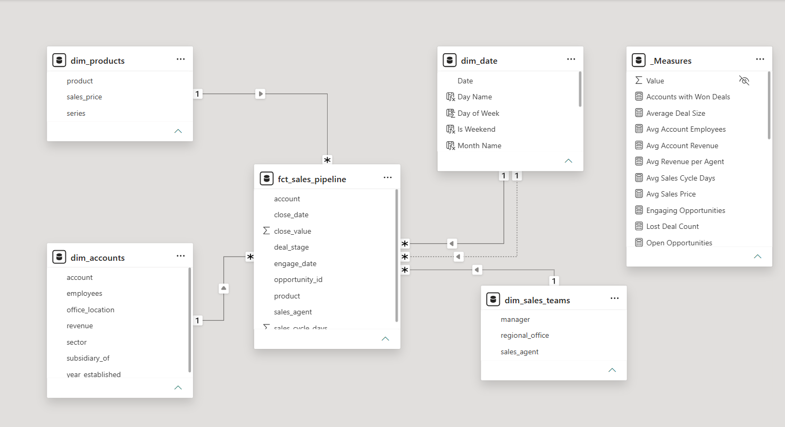
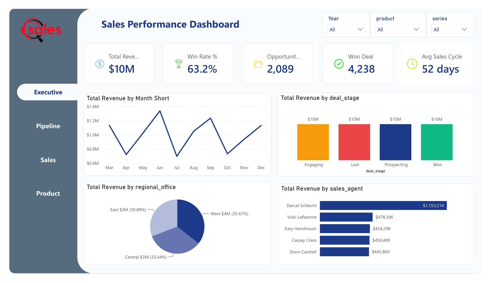
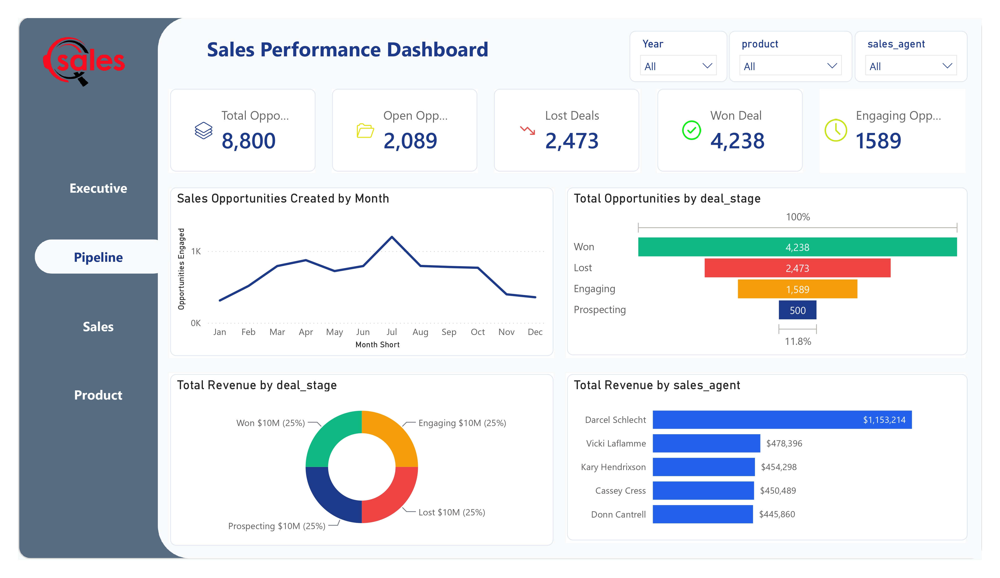
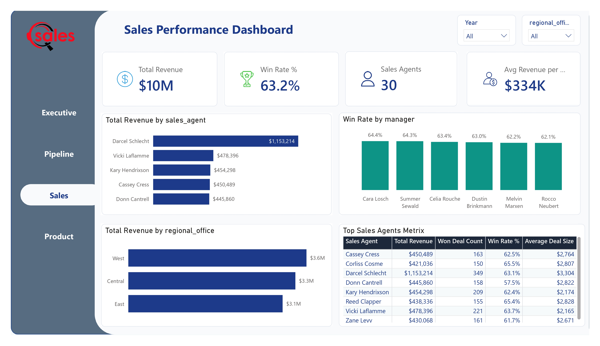
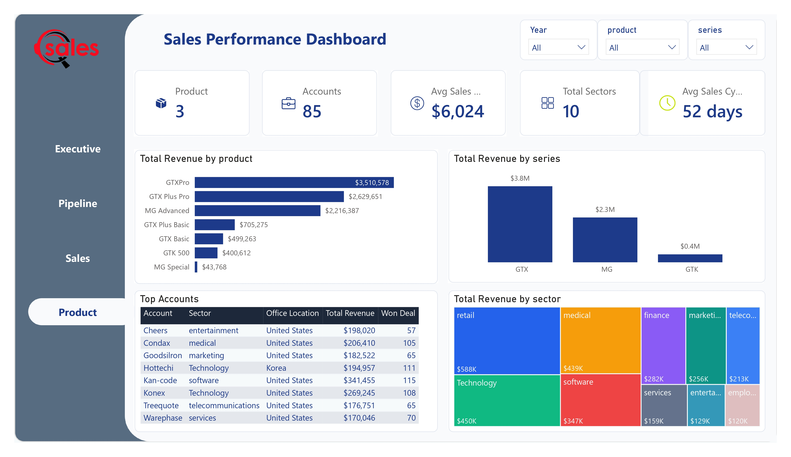

# Sales Performance & Pipeline Analysis Dashboard


---

> An end-to-end Business Intelligence project that transforms raw CRM sales data into an interactive Power BI dashboard using SQL Server and DAX.

## Table of Contents
- Project Overview
- Business Problem
- Business Objectives
- Dashboard Preview
- Project Architecture
- Data Model
- Technology Stack
- Repository Structure
- SQL Workflow
- Dashboard Pages
- Key Business Insights
- Skills Demonstrated
- Future Improvements
- Author

## Project Overview

This project demonstrates the complete Business Intelligence lifecycle, from raw CRM sales data to an interactive Power BI dashboard.

Using SQL Server, the data was cleaned, validated, transformed into analytics-ready SQL views, and connected to Power BI. DAX measures and a star schema data model were then used to build executive dashboards for business decision-making.

---

## Business Problem

The company collected sales data but lacked a centralized reporting solution to monitor performance, identify trends, and support business decisions.

The dashboard provides visibility into:

- Sales performance
- Pipeline health
- Sales team productivity
- Product performance
- Customer accounts
- Regional revenue

---

## Business Objectives

### Executive Dashboard
- Monitor total revenue
- Track overall win rate
- Measure average deal size
- Analyze revenue trends

### Pipeline Dashboard
- Analyze opportunities by month
- Monitor pipeline stages
- Evaluate sales cycle
- Measure conversion rates

### Sales Team Dashboard
- Compare sales agents
- Evaluate managers
- Compare regional offices
- Identify top performers

### Product & Account Dashboard
- Analyze product revenue
- Compare product series
- Evaluate customer sectors
- Identify top accounts

---

## Project Architecture

```text
CSV Files
    │
    ▼
SQL Server Database
    │
    ▼
Data Quality Checks
    │
    ▼
SQL Views
    │
    ▼
Power BI Data Model
    │
    ▼
DAX Measures
    │
    ▼
Interactive Dashboard
    │
    ▼
Business Insights
```

---

## Data Model

> 

---

## 🛠️ Technology Stack

| Category | Technology |
|-----------|------------|
| Database | SQL Server |
| Query Language | SQL |
| Data Modeling | Star Schema |
| Data Preparation | SQL Views |
| BI Tool | Power BI |
| Data Transformation | Power Query |
| Analytics | DAX |
| Version Control | Git & GitHub |

---

## Repository Structure

```text
Sales-Performance-Dashboard
├── Data
├── SQL
├── Power BI
├── Dashboard
├── Images
├── Presentation
└── README.md
```

---

## SQL Workflow

| Script | Purpose |
|---------|---------|
| 00_init_database.sql | Initialize database |
| 01_create_tables.sql | Create tables |
| 02_load_data.sql | Load CSV data |
| 03_data_quality_checks.sql | Validate data |
| 04_create_views.sql | Create analytics-ready views |
| 05_exploratory_data_analysis.sql | Explore the data |
| 06_business_analysis.sql | Answer business questions |
| 07_advanced_business_analysis.sql | Advanced analysis |

---

## Dashboard Pages

- Executive Dashboard
- Pipeline Dashboard
- Sales Team Dashboard
- Product & Account Dashboard

---

## Key Business Insights

Replace this section with the final insights from your dashboard.

---

## Skills Demonstrated

### Data Engineering
- SQL Server
- Data Cleaning
- ETL
- SQL Views

### Business Intelligence
- Power BI
- Power Query
- DAX
- KPI Development

### Data Modeling
- Star Schema
- Fact & Dimension Modeling

### Analytics
- Dashboard Design
- Data Visualization
- Business Analysis
- Data Storytelling

---

## Future Improvements

- Publish to Power BI Service
- Automate refresh
- Add forecasting
- Implement Row-Level Security (RLS)

---

## 👨‍💻 Author

**Yussuf Ahmed**

Aspiring Data Engineer & Business Intelligence Developer

- Portfolio: Add your portfolio URL
- LinkedIn: Add your LinkedIn URL
- GitHub: Add your GitHub URL
d
│
├── Data
│   ├── accounts.csv
│   ├── products.csv
│   ├── sales_pipeline.csv
│   ├── sales_teams.csv
│   └── data_dictionary.csv
│
├── SQL
│   ├── 00_init_database.sql
│   ├── 01_create_tables.sql
│   ├── 02_load_data.sql
│   ├── 03_data_quality_checks.sql
│   ├── 04_create_views.sql
│   ├── 05_exploratory_data_analysis.sql
│   ├── 06_business_analysis.sql
│   └── 07_advanced_business_analysis.sql
│
├── Power BI
│   ├── Sales Performance Dashboard.pbix
│   └── Dashboard.pdf
│
├── Images
│   ├── executive-dashboard.png
│   ├── pipeline-dashboard.png
│   ├── sales-dashboard.png
│   ├── product-dashboard.png
│   ├── data-model.png
│   └── architecture.png
│
├── Presentation
│   ├── Executive Presentation.pptx
│   └── Executive Presentation.pdf
│
└── README.md


---

## 🗃 SQL Workflow

| Script | Purpose |
| :--- | :--- |
| `00_init_database.sql` | Creates the core target database container. |
| `01_create_tables.sql` | Defines schema, data types, primary keys, and foreign keys. |
| `02_load_data.sql` | Imports raw CSV datasets into target tables. |
| `03_data_quality_checks.sql` | Performs null checks, duplicate detection, and integrity checks. |
| `04_create_views.sql` | Constructs analytics-ready SQL views for Power BI connection. |
| `05_exploratory_data_analysis.sql` | Executes statistical distribution & initial exploratory checks. |
| `06_business_analysis.sql` | Queries targeted aggregations to answer key business questions. |
| `07_advanced_business_analysis.sql` | Runs advanced analytics including window functions and cohort trends. |

---

## 📈 Dashboard Pages

### 1. Executive Dashboard
Focuses on macro-level KPIs including Revenue, Win Rates, Average Sales Cycle, and Regional breakdowns.  


### 2. Pipeline Dashboard
Tracks monthly opportunity creation rates, stage conversions (Won, Lost, Prospecting, Engaging), and cycle duration bottlenecks.  


### 3. Sales Team Dashboard
Evaluates individual sales agent performance, manager win rates, and regional team productivity.  


### 4. Product & Account Dashboard
Analyzes revenue generation across product lines, series performance, industry sectors, and key customer accounts.  


---

## Key Business Insights

- 💰 **Revenue Generation**: The enterprise achieved **~$10M** in cumulative revenue across all sales channels.
- 🎯 **Conversion Efficiency**: Maintained an overall win rate of **63.2%**.
- 📍 **Top Geographic Driver**: The **West Region** led total regional revenue contribution.
- 📦 **Star Product**: **GTX Pro** emerged as the top revenue-generating hardware product.
- 📈 **Pipeline Volume**: Processed and tracked over **8,000+ opportunities** across all funnel stages.

---

## Skills Demonstrated

- **Data Engineering**: SQL Server, Data Cleaning, ETL Pipeline Design, SQL Views.
- **Business Intelligence**: Power BI, Power Query, DAX Measures, Custom Visualizations.
- **Data Modeling**: Star Schema Architecture, Fact/Dimension Tables, Relationship Cardinality.
- **Analytics & Strategy**: Business Problem Solving, Executive Data Storytelling, KPI Framework Design.

---

## Future Improvements

- [ ] Connect Power BI directly to a live cloud SQL Server instance.
- [ ] Publish the report to Power BI Service with dynamic workspace permissions.
- [ ] Implement automated scheduled refreshes.
- [ ] Integrate time-series forecasting and predictive ML models for sales pipeline projection.
- [ ] Implement Row-Level Security (RLS) for dynamic user access control.

---

## 👨‍💻 Author

**Yussuf Ahmed**  
*Data Engineer & Business Intelligence Developer*

- 🌐 **Portfolio**: [Your Portfolio URL]
- 💼 **LinkedIn**: [Your LinkedIn Profile]
- 💻 **GitHub**: [Your GitHub Profile]
